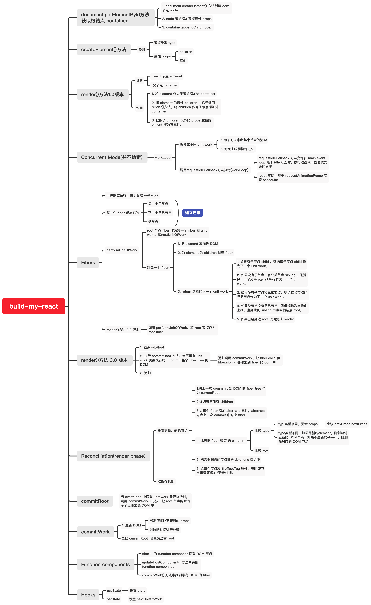

# build-my-react

## 实现 React

### 调试

demo 在 src 目录。

`yarn install`

`yarn start`

## 调试 React 源码

`react`,`react-demo`用于调试 react 源码。

## 源码解析

[我的 notion 文章](https://www.notion.so/xiaochaoshi/ddd2d6e7d3c34b46b6f165085d9bccde?v=add819883cba4e3fb27b5e3959721764)

## 参考资料

- [实现思路思维导图-xind](https://xmind.works/#/e36431)
- [build-your-own-react](https://pomb.us/build-your-own-react/)
